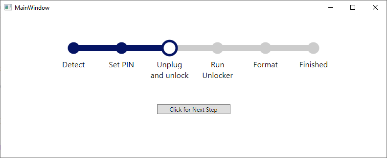
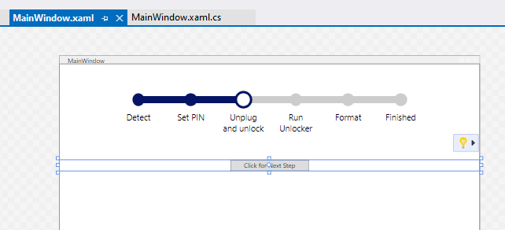

# Fancy Progress Steps Control

A simple, modern, web-style progress steps/wizard control.  Clone and run the
project to test it out, with the 'Next' button.

Tested with .Net 8.0 / WPF / Windows 10.

How it looks:

It previews in XAML designer too:

Copyright (2025) Karl Pickett

